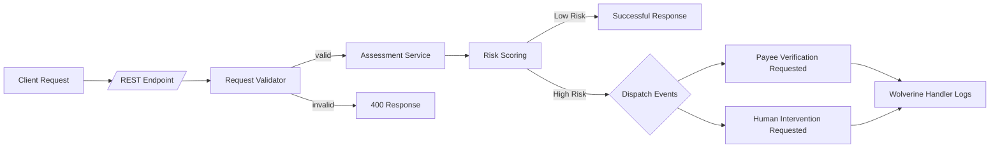

# Shield

Shield is a simplified payment fraud assessment service built with .NET 9 that demonstrates how an event-driven architecture can be composed with the Wolverine messaging framework and in-memory messages.

## Overview
- Accepts a single REST endpoint `/payment/fraud-check` that evaluates incoming payment check requests and assigns a fraud risk score.
- Triggers Wolverine events for payee verification or human intervention when thresholds are met, with handlers currently logging for observability.
- Applies straightforward authentication, validation, and business logic layers to mimic core service boundaries.

## Process Flow

## Projects
- **Shield.Api**: main ASP.NET Core service with a controller, validation, business logic services, and Wolverine handlers.
- **Shield.Api.UnitTests**: MSTest-based suite featuring example tests for service and validation workflows.
- **postman/Shield.postman_collection.json**: Postman collection for exercising the API surface.

## Next Steps
There are plenty of opportunities to extend this solution. Treat it as an exercise sandbox for experimenting with additional features and integrations.
